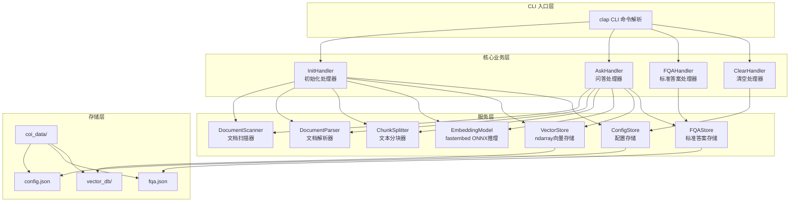
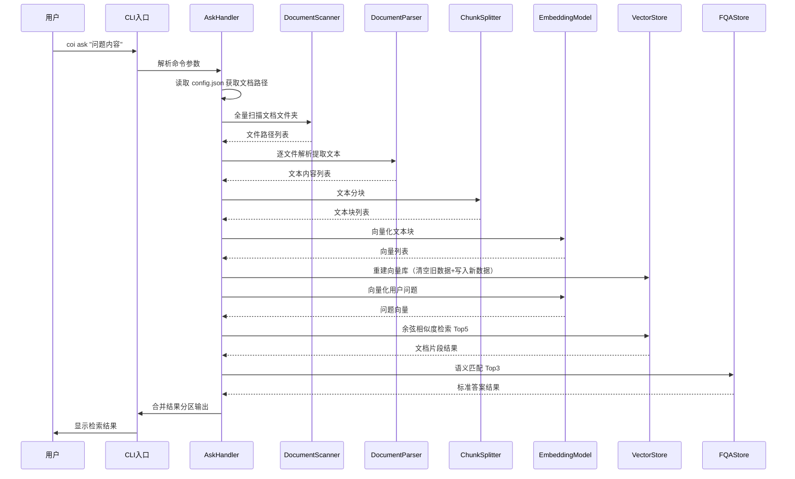

# 技术设计文档

## Overview

COI（我问你答）是一个纯本地离线文档问答 CLI 工具。系统基于 **Rust** 开发，使用 `fastembed-rs`（底层为 ONNX Runtime）加载量化嵌入模型将文档内容向量化，结合 `ndarray` 实现轻量级向量检索。用户通过 4 个 CLI 命令（init、ask、add-fqa、clear）完成文档知识库的初始化、问答查询、标准答案补充和数据清空操作。

核心设计决策：

- **开发语言**：Rust，编译为原生二进制，无运行时依赖，启动极快
- **嵌入模型**：通过 `fastembed-rs` 使用 `BAAI/bge-small-zh-v1.5`（中文优化，384 维，ONNX 量化版约 67MB），纯本地推理，无需 PyTorch
- **向量检索**：使用 `ndarray` 实现余弦相似度计算，向量数据以 `bincode` 序列化持久化。每次 ask 全量重建，无需复杂索引
- **跨平台构建**：Rust 原生支持交叉编译，在 macOS 上可通过 `cargo-xwin`（→ Windows）和 `cross`（→ Linux）直接构建三平台二进制，无需 CI
- **体积控制**：最终单平台可执行文件 + 模型文件总计约 80-90MB（Rust 二进制 ~15MB + 模型 ~67MB）

## Architecture

### 系统架构图



### 数据流图



## Components and Interfaces

### 1. CLI 入口层（src/cli.rs）

使用 `clap` derive 宏实现命令行解析。

```rust
use clap::{Parser, Subcommand};

#[derive(Parser)]
#[command(name = "coi", about = "COI - 我问你答：本地离线文档问答工具")]
pub struct Cli {
    #[command(subcommand)]
    pub command: Commands,

    /// 开启详细日志输出
    #[arg(long, global = true)]
    pub verbose: bool,
}

#[derive(Subcommand)]
pub enum Commands {
    /// 初始化文档知识库
    Init {
        /// 文档文件夹路径
        doc_path: String,
    },
    /// 提问查询
    Ask {
        /// 问题内容
        question: String,
    },
    /// 补充标准问答对
    AddFqa {
        /// 问题
        question: String,
        /// 标准答案
        answer: String,
    },
    /// 一键清空所有数据
    Clear,
}
```

### 2. DocumentScanner（文档扫描器，src/scanner.rs）

```rust
use std::path::{Path, PathBuf};

pub struct DocumentScanner {
    supported_extensions: Vec<&'static str>,
    max_file_size: u64, // 100MB
}

pub struct ScanResult {
    pub files: Vec<PathBuf>,           // 有效文件列表
    pub skipped: Vec<SkipInfo>,        // 跳过的文件及原因
    pub total_scanned: usize,          // 扫描总数
}

pub struct SkipInfo {
    pub path: PathBuf,
    pub reason: String,
}

impl DocumentScanner {
    pub fn new() -> Self;
    /// 递归扫描文件夹，返回支持格式的文件列表
    pub fn scan(&self, folder: &Path) -> Result<ScanResult>;
}
```

### 3. DocumentParser（文档解析器，src/parser.rs）

```rust
use std::path::Path;

pub struct ParseResult {
    pub content: String,       // 提取的文本内容
    pub metadata: DocMetadata, // 文档元数据
}

pub struct DocMetadata {
    pub file_name: String,
    pub file_type: String,
    pub page_count: Option<usize>, // PDF 页数
}

pub struct DocumentParser;

impl DocumentParser {
    /// 根据文件扩展名调用对应解析器
    pub fn parse(&self, file_path: &Path) -> Result<ParseResult>;
}
```

解析库选型（均为纯 Rust 实现，无 C 依赖）：

- TXT/MD：`std::fs::read_to_string`，MD 保留标题层级
- PDF：`pdf-extract` crate
- DOCX：`docx-rs` crate
- XLSX：`calamine` crate（高性能，纯 Rust）
- CSV：`csv` crate

### 4. ChunkSplitter（文本分块器，src/splitter.rs）

```rust
pub struct ChunkSplitter {
    pub chunk_size: usize,  // 默认 500 字符
    pub overlap: usize,     // 默认 50 字符
}

pub struct TextChunk {
    pub content: String,       // 文本内容
    pub source_file: String,   // 来源文件路径
    pub chunk_index: usize,    // 块序号
}

impl ChunkSplitter {
    pub fn new(chunk_size: usize, overlap: usize) -> Self;
    /// 将文本按字符数分块，保留重叠区域
    pub fn split(&self, text: &str, source_file: &str) -> Vec<TextChunk>;
}
```

### 5. EmbeddingModel（嵌入模型，src/embedding.rs）

```rust
use fastembed::{TextEmbedding, InitOptions, EmbeddingModel as FEModel};

pub struct EmbeddingService {
    model: TextEmbedding,
}

impl EmbeddingService {
    /// 从本地模型目录初始化（首次运行自动下载到 model/ 目录）
    pub fn new(model_dir: &Path) -> Result<Self> {
        let model = TextEmbedding::try_new(
            InitOptions::new(FEModel::BGESmallZHV15)
                .with_cache_dir(model_dir.to_path_buf())
                .with_show_download_progress(true),
        )?;
        Ok(Self { model })
    }

    /// 批量将文本转为 384 维向量
    pub fn encode_batch(&self, texts: Vec<&str>) -> Result<Vec<Vec<f32>>>;

    /// 单条文本向量化
    pub fn encode(&self, text: &str) -> Result<Vec<f32>>;
}
```

关键说明：
- `fastembed-rs` 封装了 ONNX Runtime + HuggingFace tokenizers
- `BAAI/bge-small-zh-v1.5`：专为中文优化的小型模型，384 维，ONNX 量化后约 67MB
- 首次运行时自动从 HuggingFace 下载模型到本地 `model/` 目录，后续完全离线
- 也可预先下载模型文件随程序一起分发

### 6. VectorStore（向量存储，src/vector_store.rs）

```rust
use ndarray::{Array1, Array2};

pub struct VectorStore {
    db_path: PathBuf,
}

pub struct SearchResult {
    pub content: String,
    pub source: String,       // "document" | "fqa"
    pub source_file: String,
    pub score: f32,
}

impl VectorStore {
    pub fn new(db_path: &Path) -> Self;

    /// 全量重建：保存向量矩阵和元数据
    pub fn rebuild(&self, chunks: &[TextChunk], embeddings: &[Vec<f32>]) -> Result<()>;

    /// 余弦相似度检索 Top-K
    pub fn query(&self, query_embedding: &[f32], top_k: usize) -> Result<Vec<SearchResult>>;

    /// 判断是否为空
    pub fn is_empty(&self) -> bool;
}
```

存储格式：
- `vector_db/embeddings.bin`：向量矩阵，bincode 序列化的 `Vec<Vec<f32>>`
- `vector_db/metadata.json`：文本块元数据（content、source_file、chunk_index）

### 7. FQAStore（标准答案存储，src/fqa_store.rs）

```rust
use serde::{Deserialize, Serialize};

#[derive(Serialize, Deserialize)]
pub struct FQAEntry {
    pub question: String,
    pub answer: String,
    pub embedding: Vec<f32>,  // 问题的向量表示
    pub created_at: String,
    pub updated_at: String,
}

pub struct FQAStore {
    fqa_path: PathBuf,
    entries: Vec<FQAEntry>,
}

impl FQAStore {
    pub fn new(fqa_path: &Path) -> Result<Self>;

    /// 添加或更新问答对
    pub fn add(&mut self, question: &str, answer: &str, embedding: Vec<f32>) -> Result<bool>;

    /// 基于余弦相似度匹配标准答案 Top-K
    pub fn search(&self, query_embedding: &[f32], top_k: usize) -> Vec<SearchResult>;

    /// 持久化到 fqa.json
    pub fn save(&self) -> Result<()>;
}
```

### 8. ConfigStore（配置存储，src/config.rs）

```rust
use serde::{Deserialize, Serialize};

#[derive(Serialize, Deserialize)]
pub struct Config {
    pub doc_folder_path: String,
    pub last_init_time: String,
}

pub struct ConfigStore {
    config_path: PathBuf,
}

impl ConfigStore {
    pub fn new(config_path: &Path) -> Self;
    pub fn save(&self, config: &Config) -> Result<()>;
    pub fn load(&self) -> Result<Option<Config>>;
    pub fn exists(&self) -> bool;
}
```

## Data Models

### config.json

```json
{
  "doc_folder_path": "/absolute/path/to/documents",
  "last_init_time": "2024-01-01T12:00:00"
}
```

### fqa.json

```json
{
  "version": 1,
  "entries": [
    {
      "question": "什么是COI？",
      "answer": "COI是一个本地离线文档问答工具。",
      "embedding": [0.123, -0.456],
      "created_at": "2024-01-01T12:00:00",
      "updated_at": "2024-01-01T12:00:00"
    }
  ]
}
```

### 目录结构

```text
coi_dist/
├── coi (或 coi.exe)              # 单个可执行文件 (~15MB)
├── model/                         # 嵌入模型文件（首次运行自动下载，或随程序分发）
│   └── bge-small-zh-v1.5/
│       ├── model_optimized.onnx   # ONNX 模型 (~67MB)
│       ├── tokenizer.json         # 分词器
│       └── config.json            # 模型配置
└── coi_data/                      # 运行时数据目录
    ├── config.json                # 用户配置
    ├── fqa.json                   # 标准问答库
    └── vector_db/                 # 向量存储
        ├── embeddings.bin         # 向量矩阵（bincode 格式）
        └── metadata.json          # 文本块元数据
```

### 打包体积估算

| 组件 | 体积 |
| ---- | ---- |
| Rust 编译二进制（release + strip） | ~15MB |
| ONNX Runtime 动态库（随 fastembed 链接） | 含在二进制中 |
| ONNX 模型文件（bge-small-zh-v1.5） | ~67MB |
| tokenizer.json + 配置文件 | ~2MB |
| **总计** | **~85MB** |

对比 Python 方案（~220MB），体积减少约 60%。

## Cross-Platform Build（跨平台构建）

### 方案：macOS 本地交叉编译

Rust 原生支持交叉编译，配合工具链可在 macOS 上直接构建三平台二进制：

```bash
# 安装交叉编译工具
# macOS → Windows (MSVC target)
cargo install cargo-xwin
# macOS → Linux (通过 cross，使用 Docker)
cargo install cross

# 构建 macOS 本机版本
cargo build --release

# 构建 Windows 版本（在 macOS 上）
cargo xwin build --release --target x86_64-pc-windows-msvc

# 构建 Linux 版本（在 macOS 上，需要 Docker）
cross build --release --target x86_64-unknown-linux-gnu
```

### 注意事项

- `cargo-xwin`：自动下载 Windows SDK 头文件和库，无需 Windows 机器
- `cross`：使用 Docker 容器提供 Linux 交叉编译环境
- ONNX Runtime 动态库：`fastembed-rs` 通过 `ort` crate 管理，会自动为目标平台下载对应的预编译库
- 模型文件跨平台通用（ONNX 格式），无需为每个平台单独准备

### 可选：GitHub Actions CI（自动化）

如果不想本地安装 Docker（cross 需要），也可以用 GitHub Actions：

```yaml
# .github/workflows/build.yml
name: Build

on:
  push:
    tags: ['v*']

jobs:
  build:
    strategy:
      matrix:
        include:
          - os: macos-latest
            target: x86_64-apple-darwin
            artifact: coi-macos-x64
          - os: macos-latest
            target: aarch64-apple-darwin
            artifact: coi-macos-arm64
          - os: ubuntu-latest
            target: x86_64-unknown-linux-gnu
            artifact: coi-linux-x64
          - os: windows-latest
            target: x86_64-pc-windows-msvc
            artifact: coi-windows-x64

    runs-on: ${{ matrix.os }}
    steps:
      - uses: actions/checkout@v4
      - uses: dtolnay/rust-toolchain@stable
        with:
          targets: ${{ matrix.target }}
      - run: cargo build --release --target ${{ matrix.target }}
      - uses: actions/upload-artifact@v4
        with:
          name: ${{ matrix.artifact }}
          path: target/${{ matrix.target }}/release/coi*
```

### 模型文件分发策略

两种方式可选：

1. **首次运行自动下载**（默认）：程序首次执行时从 HuggingFace 下载模型到 `model/` 目录，后续完全离线
2. **预打包分发**：将模型文件与可执行文件一起打包分发，用户解压即用，完全无需联网

推荐方式 2 用于正式发布，方式 1 用于开发调试。

## Rust 项目结构

```text
coi/
├── Cargo.toml                 # 项目配置和依赖
├── Cargo.lock
├── src/
│   ├── main.rs                # 入口，初始化 CLI
│   ├── cli.rs                 # clap 命令定义
│   ├── handlers/              # 命令处理器
│   │   ├── mod.rs
│   │   ├── init.rs            # init 命令逻辑
│   │   ├── ask.rs             # ask 命令逻辑
│   │   ├── add_fqa.rs         # add-fqa 命令逻辑
│   │   └── clear.rs           # clear 命令逻辑
│   ├── scanner.rs             # 文档扫描器
│   ├── parser.rs              # 文档解析器
│   ├── splitter.rs            # 文本分块器
│   ├── embedding.rs           # 嵌入模型封装
│   ├── vector_store.rs        # 向量存储
│   ├── fqa_store.rs           # FQA 存储
│   ├── config.rs              # 配置管理
│   └── error.rs               # 统一错误类型
├── model/                     # 模型文件（.gitignore）
├── scripts/
│   └── download_model.sh      # 模型下载脚本
└── tests/
    ├── integration/           # 集成测试
    └── fixtures/              # 测试用文档
```

### Cargo.toml 核心依赖

```toml
[package]
name = "coi"
version = "0.1.0"
edition = "2021"

[dependencies]
# CLI 框架
clap = { version = "4", features = ["derive"] }

# 嵌入模型推理
fastembed = "5"

# 向量计算
ndarray = "0.16"

# 序列化
serde = { version = "1", features = ["derive"] }
serde_json = "1"
bincode = "1"

# 文档解析
pdf-extract = "0.7"       # PDF 文本提取
docx-rs = "0.4"           # DOCX 解析
calamine = "0.26"         # XLSX 读取
csv = "1"                 # CSV 读取

# 工具
walkdir = "2"             # 递归目录遍历
chrono = "0.4"            # 时间处理
anyhow = "1"              # 错误处理
thiserror = "2"           # 自定义错误类型

[profile.release]
opt-level = "z"           # 优化体积
lto = true                # 链接时优化
strip = true              # 去除调试符号
codegen-units = 1         # 单代码生成单元，最大优化
```

## Correctness Properties

### Property 1: 配置路径存储往返一致性

对于任意有效的文件夹绝对路径，执行 init 命令保存路径后，从 config.json 读取的路径应与原始传入路径完全一致。

**Validates: Requirements 1.1**

### Property 2: 文档扫描器正确识别支持格式

对于任意包含混合文件类型的目录结构，DocumentScanner 返回的文件列表应仅包含扩展名属于支持集合（.txt/.md/.pdf/.docx/.xlsx/.csv）的文件。

**Validates: Requirements 1.2**

### Property 3: 部分文档处理失败时的容错性

对于任意包含有效文档和无效文档的文件集合，系统处理后成功数量加失败数量应等于总文件数量，且所有有效文档均被成功处理。

**Validates: Requirements 1.6, 6.9**

### Property 4: 向量检索结果排序不变量

对于任意用户查询和非空向量库，VectorStore 返回的结果数量不超过 5 条，且结果按相似度分数降序排列。

**Validates: Requirements 2.2**

### Property 5: FQA 匹配结果排序不变量

对于任意用户查询和非空 FQA 存储，FQA 语义匹配返回的结果数量不超过 3 条，且结果按相似度分数降序排列。

**Validates: Requirements 2.3**

### Property 6: 空白输入拒绝

对于任意仅由空白字符组成的字符串，当作为 ask 命令的问题参数或 add-fqa 命令的问题/答案参数时，系统应拒绝该输入并返回错误提示。

**Validates: Requirements 2.8, 3.3**

### Property 7: 标准问答对存储往返一致性

对于任意有效的问题-答案对，执行 add-fqa 添加后，从 fqa.json 读取应能找到该问题对应的完全一致的答案内容。

**Validates: Requirements 3.1**

### Property 8: 重复问题更新幂等性

对于任意已存在于 FQA 存储中的问题，使用相同问题但不同答案再次执行 add-fqa 后，FQA 存储中该问题仅存在一条记录，且答案为最后一次提供的值。

**Validates: Requirements 3.2**

### Property 9: 清空命令完整性

对于任意 coi_data 目录状态，执行 clear 命令后，coi_data 目录应不再存在于文件系统中。

**Validates: Requirements 4.1**

### Property 10: 向量库实时同步一致性

对于任意文档文件夹状态变更（新增、修改或删除文件），执行 ask 命令后重建的向量库应仅包含当前文件夹中实际存在的文件内容。

**Validates: Requirements 8.1, 8.2, 8.3, 8.4**

### Property 11: 文本格式文档解析往返一致性

对于任意有效的纯文本内容，写入 TXT 文件后通过 DocumentParser 解析提取的文本应包含原始写入的全部内容。

**Validates: Requirements 6.1, 6.6**

### Property 12: 不支持格式跳过不变量

对于任意扩展名不属于支持集合的文件，DocumentScanner 应将其归入跳过列表，且跳过记录中包含文件名和跳过原因。

**Validates: Requirements 6.7**

## Error Handling

### 统一错误类型（src/error.rs）

```rust
use thiserror::Error;

#[derive(Error, Debug)]
pub enum CoiError {
    #[error("[错误] 路径无效: {path}\n  原因: 指定的文件夹不存在\n  建议: 请检查路径是否正确")]
    InvalidPath { path: String },

    #[error("[错误] 未初始化\n  原因: 未找到配置文件\n  建议: 请先执行 coi init <文档文件夹路径>")]
    NotInitialized,

    #[error("[错误] 输入无效\n  原因: {reason}\n  建议: 请输入有效的内容")]
    InvalidInput { reason: String },

    #[error("[错误] 文件解析失败: {file}\n  原因: {reason}")]
    ParseError { file: String, reason: String },

    #[error("[错误] 模型加载失败\n  原因: {reason}\n  建议: 请确认 model/ 目录下模型文件完整")]
    ModelError { reason: String },

    #[error("[错误] 删除失败\n  原因: {reason}\n  建议: 请检查文件权限或关闭占用程序")]
    ClearError { reason: String },

    #[error("[错误] {0}")]
    Other(#[from] anyhow::Error),
}
```

### 错误处理策略

| 错误类型 | 触发条件 | 处理方式 |
| ---- | ---- | ---- |
| 路径无效 | init/ask 传入不存在的路径 | 立即终止当前命令 |
| 配置缺失 | ask 时 config.json 不存在 | 立即终止 |
| 输入为空 | ask/add-fqa 传入空白字符串 | 拒绝执行 |
| 文件解析失败 | 文档加密/损坏/格式异常 | 跳过该文件继续处理 |
| 文件过大 | 文件超过 100MB | 跳过该文件继续处理 |
| 文件夹为空 | 无支持格式文档 | 终止扫描流程 |
| 删除失败 | 文件被占用/权限不足 | 终止 clear 操作 |
| 模型加载失败 | 模型文件损坏/缺失 | 终止程序 |

## Testing Strategy

### 单元测试

Rust 内置测试框架，每个模块文件底部包含 `#[cfg(test)] mod tests`。

覆盖范围：
- ConfigStore 路径存储往返
- DocumentScanner 格式识别和过滤
- ChunkSplitter 分块逻辑和重叠
- FQAStore 增删改查
- VectorStore 余弦相似度计算正确性
- 输入验证（空白字符串拒绝）

### 集成测试（tests/ 目录）

覆盖范围：
- 完整 init → ask → add-fqa → clear 工作流
- 文档变更后 ask 结果同步验证
- 各文档格式解析验证（使用 fixtures/ 下的测试文件）
- 边界条件：0 字节文件、特殊字符文件名

### 测试命令

```bash
# 运行所有测试
cargo test

# 运行特定模块测试
cargo test --lib scanner
cargo test --lib vector_store

# 运行集成测试
cargo test --test integration
```
